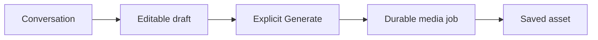

# Native Notion block examples

Read the live enhanced Markdown specification through Notion MCP first. Notion Markdown differs from GitHub Markdown: tables use XML-style blocks, and toggle children use tabs.

## Status callout and date handle

```markdown
<callout icon="🧭" color="blue_bg">
	**Planning.** Provider compatibility is still unverified.
	Updated <mention-date start="2026-10-04"/>.
</callout>
```

For a time, use `startTime` and `timeZone` as required by the live specification. Do not guess a timezone.

## Comparison table

```markdown
## ⚖️ Current choices
<table header-row="true" fit-page-width="true">
	<tr><td>Choice</td><td>State</td><td>Next evidence</td></tr>
	<tr><td>Chat library</td><td>Proposed</td><td>Demonstrate editing and revisions</td></tr>
</table>
```

Cells contain rich text, not nested blocks. Keep them short and move long explanations into a toggle below.

## Collapsed detail

```markdown
---
<details>
<summary>📚 Archived validation evidence</summary>
	### Acceptance criteria
	- [ ] Manual edits reach the next conversation turn.
	- [ ] Generate submits the reviewed draft revision.
	### Evidence
	Link the actual PR and validation results when available.
</details>
```

Indent every child line with a tab. Label toggles by their contents rather than "More".

## Mermaid diagram

Use a `mermaid` fenced block. For example:

~~~markdown
## 🏗️ Proposed generation flow

~~~

Use quoted labels and compact graphs. Use sequence diagrams for ordered interactions and state diagrams for lifecycle behavior. Do not substitute a text arrow list when a diagram communicates the relationship better.

## Page icons and structural references

Set a distinct native blue icon using the page update tool's supported icon field. Verified Notion SVG assets include `icons/document_blue`, `icons/map_blue`, `icons/list_blue`, `icons/book_blue`, and `icons/flag_blue`. Use a symbol fitting each page, not the same megaphone for every sibling. Confirm the chosen identifier is supported by the connected tool and fetch afterward to check native icon metadata.

Preserve `<page url="...">...</page>` for existing child pages. Using `<mention-page>` instead changes the structural meaning and can remove the child. Do not create a parent mention merely to provide a backlink.

Check block order after writing: a table and description belonging beneath a heading must appear there, with child-page navigation grouped together rather than interleaved with those blocks.
